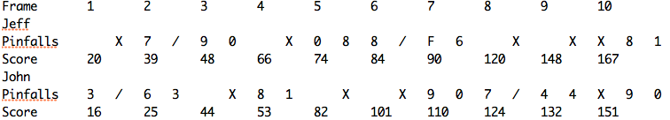

#Zebra Technologies - Interview Coding Exercise

This is java application is developed to demonstrate my ability to build a greenfield project, specifically a command-line application to score a game of ten-pin bowling.

This java program displays the results of a bowling match in a readable format by processing the input text file that contains the scores of the game.

- The format of the data in the input text file should be as below.

```
NameOfTheBowler BallsPinedDown
```

- The content of the input text file (e.g., ‘game.txt’) for several players bowling 10 frames each. Should be like:

```
Jeff 10
John 3
John 7
Jeff 7
Jeff 3
John 6
John 3
Jeff 9
Jeff 0
John 10
Jeff 10
John 8
John 1
Jeff 0
Jeff 8
John 10
Jeff 8
Jeff 2
John 10
Jeff F
Jeff 6
John 9
John 0
Jeff 10
John 7
John 3
Jeff 10
John 4
John 4
Jeff 10
Jeff 8
Jeff 1
John 10
John 9
John 0
```
  - Each line represents a player and a chance with the subsequent number of pins knocked down.
  - An 'F' indicates a foul on that chance and no pins knocked down (identical for scoring to a roll of 0).
  - The input shall be valid (i.e., no chance will produce a negative number of knocked down pins or more than 10, etc).
  - The rows are tab-separated.
  
- The output of program will be a scoring board displayed as below for the sample data shown above.




### Steps to Execute the application

Step 1. Navigate to the source code folder
```
cd bowling-coding-exercise
```

Step 2. Run the below command to build the app
```
mvn clean install
```

Step 3. Execute the application
```
java -jar target/bowling-game.jar <inputfile>
```

Step 4. Command with sample file present in the folder game.txt
```
java -jar target/bowling-game.jar game.txt
```

Note: Ensure that you have JDK 8+ in your system installed.
